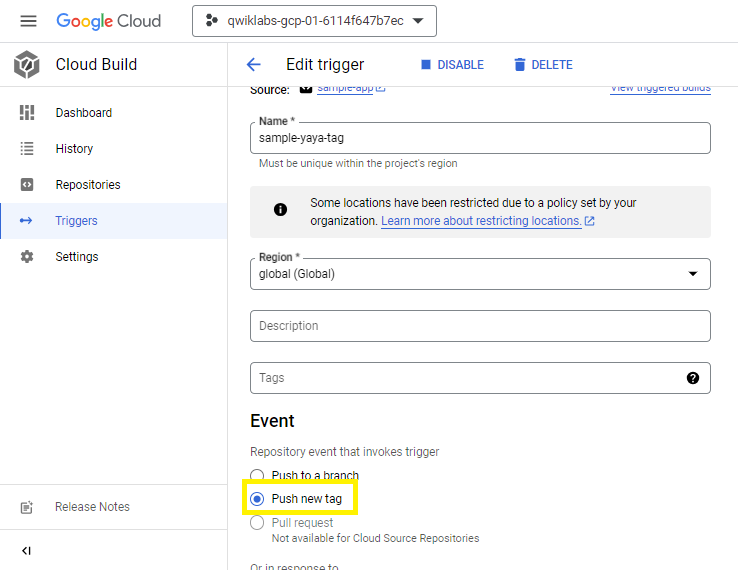

# The Power of Labels and Categories

<details>
<summary>Open Thread</summary>


This initially started as a thread by [Jason](https://twitter.com/LinuxTekCanada/), and he quickly figured out how to do it :D !


**Here it is**, so all of us reap the benefits:

</details>


#### **Attribution:**
```
git tag -a weekx <commit hash> -m "Week X PR Merge"
```

To push just the tags:

```
git push --tags
```

## My Weekly Hash Tracker

| Week | Latest Commit Hash | Assigned Name |
|:------:|:--------------------|:----------|
| [week0](#week-0) | e89ef4d535d8d87c093047cd15ae2b1e80e822cc | Week 0: Fully Completed |
| [week1](#week-1) | 5b371e480da18db52bbd545344290bb18aa9c351 | Week 1 & 2✅ |
| [week2](#week-2) | b541ecba4f4c8e125e4d5171dcfc4fa141c375d0 | Week2: Articulation Journal |
| [week3](#week-3) | 2439b040922d219bc3a2cfc0e57644cff26b8c1e | Week3: Relational Database |
| [week4](#week-4) | 12dae757bec2464a6309f68093165deb2e92988a | Week4: Discord Assets |


## Commits & Hash

<details>
<summary><b>This item</b> summarizes a commit, including the location of the hash.</summary>


</details>

- Get recent 5 commits, their hashes, and associated designations:

```sh
git log -5 --pretty=format:"%h - %s"
```

- output:

<pre>
```console
gitpod /workspace/aws-cloud-project-bootcamp (main) $ git log -5 --pretty=format:"%h - %s"
a6a44d5 - Typo: Even the Smallest Things Count
d414fbe - Week 8: Minor Fixes
0b64b39 - Developer Experience
7ea1c93 - Week 9: Instagram Assets
ccc16cf - Week 8: Implement User Edit Functionality
```
</pre>


<details>
<summary><b>Remove Tags</b> </summary>
<br>

**Check Available tags**
```
git tag
```

- returning

```sh
gitpod /workspace/aws-cloud-project-bootcamp (main) $ git tag
week0
week1
week2
week3
week4
week5
week6
week6-7
```

I want to have week6 and 7 seperate so?

**Remove week6-7**

```sh
git tag -d <tag-name>
```
- Returning

```
Deleted tag 'week6-7' (was 02579ac)
```

**Push removal from GitHub**

```
git push --delete origin <tagname>
```
- Returning
```
To https://github.com/yaya2devops/aws-cloud-project-bootcamp.git
 - [deleted]         week6-7
```

**List Tags again:**
```
gitpod /workspace/aws-cloud-project-bootcamp (main) $ git tag
week0
week1
week2
week3
week4
week5
week6
```


Ps: you can delete it directly from [github/username/repo-name/tags](https://github.com/yaya2devops/aws-cloud-project-bootcamp/tags)


</details>

## Application

### Week 0:
```
git tag -a week0 5b371e480da18db52bbd545344290bb18aa9c351 -m "Tagging for week0"
```

### Week 1:
```
git tag -a week1 5b371e480da18db52bbd545344290bb18aa9c351 -m "Tagging for week1"
```

### Week 2:
```
git tag -a week2 b541ecba4f4c8e125e4d5171dcfc4fa141c375d0 -m "Tagging for week2"
```


### Week 3:
```
git tag -a week3 2439b040922d219bc3a2cfc0e57644cff26b8c1e -m "Tagging for week3"
```


### Week 4:
```
git tag -a week4 12dae757bec2464a6309f68093165deb2e92988a -m "Tagging for week4"
```

<details>
<summary><b>Desired outcomes:</b></summary>


> [Developer Reference](https://github.com/yaya2devops/aws-cloud-project-bootcamp/tags)

</details>


## Tagging PoC

A good thing about tagging that you can trigger a pipeline on tag push as follows:




And when you fully commit to something, exemplified by...
```sh
$ git commit -a -m "Building the Future"
[master ff0048c] Building the Future
 4 files changed, 4 insertions(+), 4 deletions(-)
```

And then proceed to push the tag

```sh
$ git tag v1.0.0

$ git push --tags
Enumerating objects: 14, done.
Counting objects: 100% (14/14), done.
Delta compression using up to 2 threads
Compressing objects: 100% (8/8), done.
Writing objects: 100% (8/8), 767 bytes | 767.00 KiB/s, done.
Total 8 (delta 5), reused 0 (delta 0), pack-reused 0
remote: Resolving deltas: 100% (5/5)
remote: Waiting for private key checker: 4/4 objects left
To https://source.developers.google.com/p/qwiklabs-gcp-01-6114f647b7ec/r/sample-yaya-app
 * [new tag]         v1.0.0 -> v1.0.0
```


It will initiate the build process, you can review it in the revision history.


