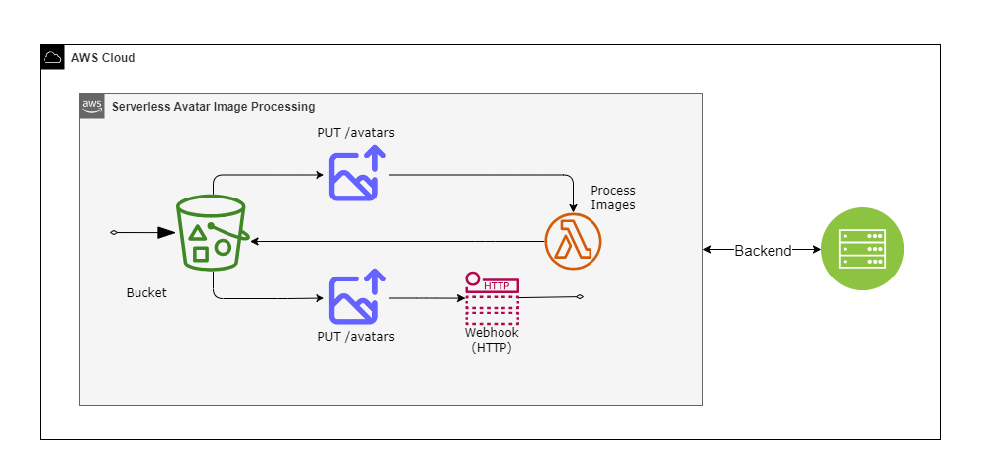
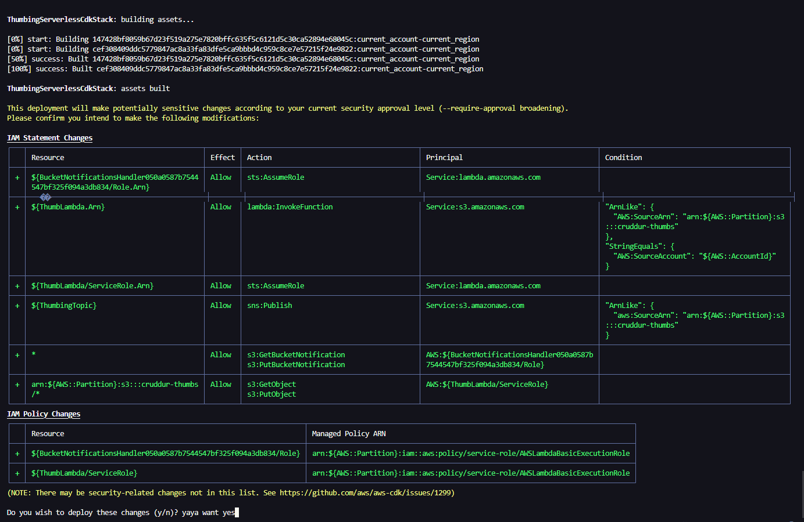
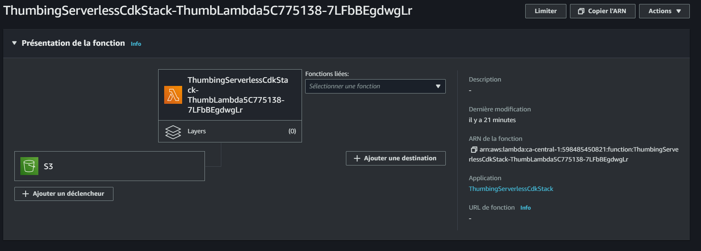
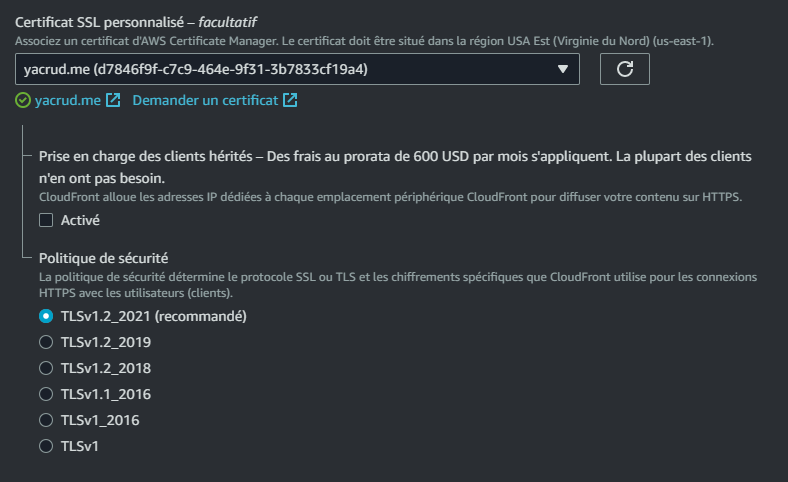
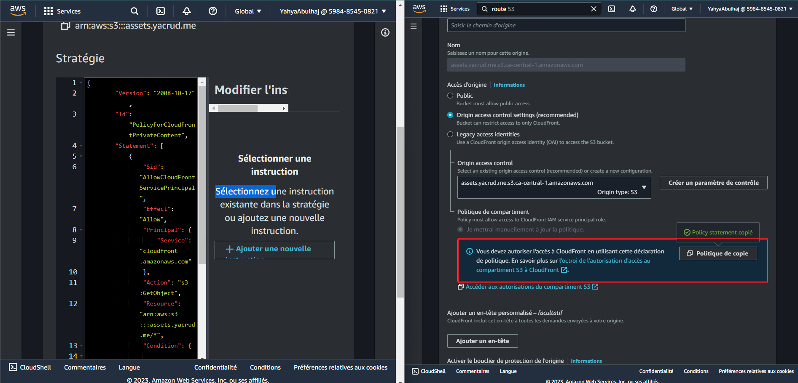
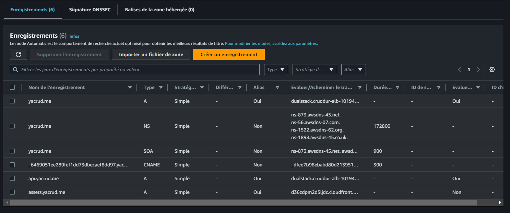
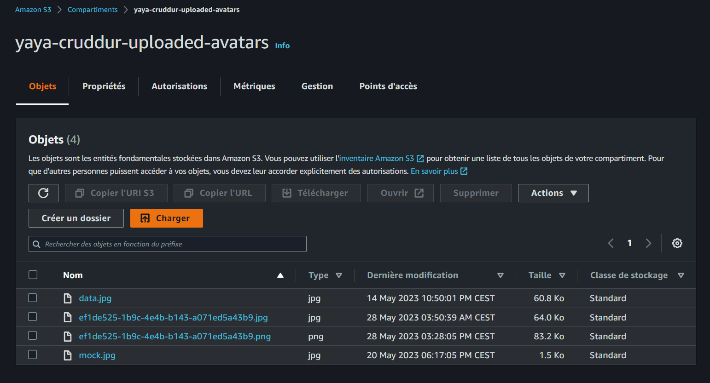
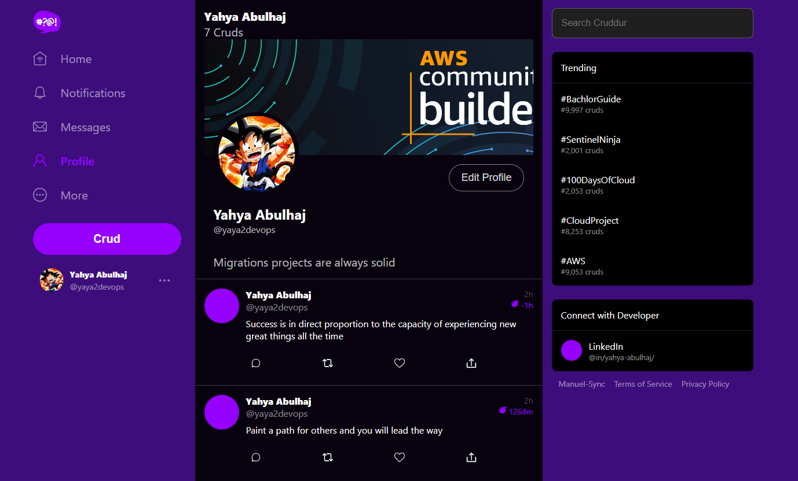

# Week 8 — Serverless Image Processing

During this week, we employed the AWS CDK to define and deploy the necessary resources for image processing. Our chosen programming language for the infrastructure development was the powerful and cool [TypeScript](https://dev.to/andrewbaisden/moving-from-javascript-to-typescript-40ac).



**Get** the design in [PNG](assets/week8/Serverless-Architect/serverless-avatar-image-process-bannered.png) or an [Editable](assets/week8/Serverless-Architect/banner-more-interesting.drawio) Format.
## Main Week Eight Tasks
This week, I must say it reaches its peak with [this particular meme](assets/week8/memes/image.png).

- [Realtime Notes Taking](#livestream--noting-realtime)
- [Implement CDK Stack](#implement-image-process-stack-with-cdk-rework)
  - [Create S3 Bucket](#create-the-s3-bucket)
  - [Provison CDK Lambda](#implement-lambda)
  - [Process Images Lambda](#implement-process-images-lambda-function)
  - [Sharp Package Script](#sharp-package-script)
  - [Implement S3 Event Notification](#implement-s3-event-notification-handle)
- [Upload and Clear Assets Scripts](#upload-asset-script)
  - [Updates Upload and Clear Scripts](#upload-and-clear-scripts-changes)
- [Serve Avatars via CloudFront](#cloudfront---serve-avatars)
  - [Upload and Serve Buckets](#configuring-bucket-for-uploading-and-bucket-for-serving)
- [Implement Users Profile Page](#coding-space---develop-user-profile)
- [Base Path for Imports in ReactJS](#base-path-for-imports-in-reactjs)
- [Implement Backend Migrations](#database-migration)
  - [Document Profile Update API](#profile-update-endpoint)
  - [Implement Users Profile Form](#implement-profile-form-and-popup)
  - [Implement Application Bio](#implement-application-bio)
- [Presigned URL generation via Ruby Lambda](#implement-avatar-uploading)
   - [Presigned URL Function](#pre-signed-url-lambda)
   - [Test API Endpoint](#test-api-endpoint)
   - [Presigned URL Lambda](#presigned-lambda-console)
   - [Lambda Bucket Policy](#apply-code-and-permissions)
- [HTTP API Gateway with Lambda Authorizer](#create-cruddurapigatewaylambdaauthorizer)
   - [API Gateway Log Group](#explicit-api-gateway-logs-group-creation)
- [Create JWT Lambda Layer	https](#setting-up-the-jwt-lambda-layer)
- [Render Avatars in App via CloudFront](#render-avatar-from-cloudfront)

## AWS Cloud Development Kit
AWS CDK is an open-source software development framework that enables you to define cloud infrastructure in code and provision it using AWS CloudFormation.


[XXL Asset](assets/week8/cdk-ban-full.png)


Let's discuss cdk actually Works

1. Define infrastructure using AWS CDK: Write code using your preferred programming language to define AWS resources such as EC2 instances, S3 buckets, Lambda functions, etc.
2. Synthesize CDK app: Use the CDK toolkit to synthesize the AWS CloudFormation templates from your CDK app code. This step generates the CloudFormation templates that will be used for deployment.
3. Deploy using AWS CloudFormation: Deploy the synthesized CloudFormation templates using AWS CloudFormation. CDK leverages CloudFormation's capabilities for provisioning and managing infrastructure resources.

Find more about [CDK Dev](../thumbing-serverless-cdk/lib/README.md)
| Feature                                   | Description                                                                                      |
| ----------------------------------------- | ------------------------------------------------------------------------------------------------ |
| Familiar Prog. languages            | supports popular programming languages like TypeScript, Python, Java, and more.          |
| Declarative infrastructure               | Infrastructure resources can be defined in a declarative manner using code.                       |
| AWS CloudFormation            |provisions infrastructure resources using AWS CloudFormation under the hood.                 |
| Construct library                         |offers a construct library with pre-built components for AWS resources and patterns.          |
| Stacks and environments                   |allows you to define multiple stacks and environments for organizing your infrastructure.    |


### Benefits of Using CDK include the following.

- **Reduced complexity**: simplifies the process of defining infrastructure as code
- **Improved productivity**: you can automate the provisioning and management of resources
- **Greater flexibility**: flexibility to design and deploy complex architectures
- **Ecosystem integration**:  with other AWS services and tools, such as AWS CodePipeline and AWS CodeDeploy, enabling seamless CI/CD pipelines.


---

## [Livestream — Noting Realtime](https://www.youtube.com/watch?v=YiSNlK4bk90)

Along the lifestream, I created 2 functions within `thumbing-serverless-cdk-stack.ts`.

> You can find my +20 in the comments at 1:12:41.

- Created Bucket

```ts
  createBucket(bucketName: string): s3.IBucket{
    const bucket =  new s3.Bucket(this, 'ThumbingBucket', {
    bucketName: bucketName,
    removalPolicy: cdk.RemovalPolicy.DESTROY,
    });
    return bucket;
    }
```    

- Generates a CloudFormation template for an AWS CDK app

```sh
cdk synth
```

**Output:**
```YML
Resources:
  # --This was manually inserted --
  ThumbingBucket715A2537:
    Type: AWS::S3::Bucket
    UpdateReplacePolicy: Delete
    DeletionPolicy: Delete
    Metadata:
      aws:cdk:path: ThumbingServerlessCdkStack/ThumbingBucket/Resource
  CDKMetadata:
    Type: AWS::CDK::Metadata
    Properties:
      Analytics: v2:deflate64:H4sIAAAAAAAA/zPSMzfWM1BMLC/WTU7J1s3JTNKrDi5JTM7WAQrFFxvrVTuVJmenlug4p+VBWLUgZlBqcX5pUXIqiO2cn5eSWZKZn1erk5efkqqXVaxfZmihZ2gKNDerODNTt6g0ryQzN1UvCEIDAFohbiRzAAAA
    Metadata:
      aws:cdk:path: ThumbingServerlessCdkStack/CDKMetadata/Default
    Condition: CDKMetadataAvailable
Conditions:
  CDKMetadataAvailable:
    Fn::Or:
      - Fn::Or:
          - Fn::Equals:
              - Ref: AWS::Region
              - af-south-1
          - Fn::Equals:
              - Ref: AWS::Region
              - ap-east-1
          - Fn::Equals:
              - Ref: AWS::Region
              - ap-northeast-1
          - Fn::Equals:
              - Ref: AWS::Region
              - ap-northeast-2
          - Fn::Equals:
              - Ref: AWS::Region
              - ap-south-1
          - Fn::Equals:
              - Ref: AWS::Region
              - ap-southeast-1
          - Fn::Equals:
              - Ref: AWS::Region
              - ap-southeast-2
          - Fn::Equals:
              - Ref: AWS::Region
              - ca-central-1
          - Fn::Equals:
              - Ref: AWS::Region
              - cn-north-1
          - Fn::Equals:
              - Ref: AWS::Region
              - cn-northwest-1
      - Fn::Or:
          - Fn::Equals:
              - Ref: AWS::Region
              - eu-central-1
          - Fn::Equals:
              - Ref: AWS::Region
              - eu-north-1
          - Fn::Equals:
              - Ref: AWS::Region
              - eu-south-1
          - Fn::Equals:
              - Ref: AWS::Region
              - eu-west-1
          - Fn::Equals:
              - Ref: AWS::Region
              - eu-west-2
          - Fn::Equals:
              - Ref: AWS::Region
              - eu-west-3
          - Fn::Equals:
              - Ref: AWS::Region
              - me-south-1
          - Fn::Equals:
              - Ref: AWS::Region
              - sa-east-1
          - Fn::Equals:
              - Ref: AWS::Region
              - us-east-1
          - Fn::Equals:
              - Ref: AWS::Region
              - us-east-2
      - Fn::Or:
          - Fn::Equals:
              - Ref: AWS::Region
              - us-west-1
          - Fn::Equals:
              - Ref: AWS::Region
              - us-west-2
Parameters:
  BootstrapVersion:
    Type: AWS::SSM::Parameter::Value<String>
    Default: /cdk-bootstrap/hnb659fds/version
    Description: Version of the CDK Bootstrap resources in this environment, automatically retrieved from SSM Parameter Store. [cdk:skip]
Rules:
  CheckBootstrapVersion:
    Assertions:
      - Assert:
          Fn::Not:
            - Fn::Contains:
                - - "1"
                  - "2"
                  - "3"
                  - "4"
                  - "5"
                - Ref: BootstrapVersion
        AssertDescription: CDK bootstrap stack version 6 required. Please run 'cdk bootstrap' with a recent version of the CDK CLI.
```

- Get ready to deploy

from what i understood this command creates an S3 bucket to store the deployment artifacts, DynamoDB table to store CDK toolkit metadata, and an IAM role to grant CDK permissions to your AWS account.

```Sh
cdk bootstrap "aws://<awsid>/<region>"
```


- package and deploy AWS resources

```sh
cdk deploy
```


- created Lambda

```ts
  createLambda(functionPath: string): lambda.IFunction {
    const lambdaFunction = new lambda.Function(this, 'ThumbLambda', {
      runtime: lambda.Runtime.NODEJS_14_X,
      handler: 'index.handler',
      code: lambda.Code.fromAsset(functionPath)
    });
    return lambdaFunction;
  }
```


- created .env to include the env var under the cdk `thumbing-serverless-cdk` dir

```sh
THUMBING_BUCKET_NAME="cruddur-thumbs-buck"
THUMBING_FUNCTION_PATH="/workspace/aws-cloud-project-bootcamp/aws/lambdas"
```

**Returning Error:**


**Solution:**

added this lines to our `thumbing-serverless-cdk-stack.ts` file:
```ts
const dotenv= require('dotenv')
dotenv.config();
```

- Install "dotenv":

```sh
npm i dotenv
```


- Synthesize:

```sh
cdk synth
```


- Adding environement variable to our lambda functions

```ts
createLambda(bucketName: string, folderInput: string, folderOutput: string )
```

 created this env within the func:

```ts
      environment: {
        DEST_BUCKET_NAME: bucketName,
        FOLDER_INPUT: folderInput,
        FOLDER_OUTPUT: folderOutput,
        PROCESS_WIDTH:  '512',
        PROCECSS_HEIGHT: '512'
    }
```


Initialized 'folderInput' and 'folderOutput' with S3 input and output folders retrieved from environment variables,
```sh
   const folderInput: string = process.env.THUMBING_S3_FOLDER_INPUT as string;
   const folderOutput: string = process.env.THUMBING_S3_FOLDER_OUTPUT as string;
```

- passed them as parameters to the 'createLambda' method to instantiate the Lambda function.
```ts
   const lambdaFunction = this.createLambda(functionPath, bucketName, folderInput, folderOutput);
```

-  defined S3 input and output folders for the Thumbing Lambda function in the .env file 

```
THUMBING_S3_FOLDER_INPUT="avatar/original"
THUMBING_S3_FOLDER_INPUT="avatar/processed"
```
## Implement Image Process Stack with CDK (REWORK)

### Create The **S3 bucket**

The following steps will guide you through setting up an S3 bucket for serverless avatar image processing using the AWS CDK:

1. Create a new directory and initialize a new CDK app using the following commands:

```bash
mkdir thumbing-serverless-cdk
cd thumbing-serverless-cdk
npm install aws-cdk -g
cdk init app --language typescript
```

2. In the `lib/thumbing-serverless-cdk-stack.ts` file, define the following S3 bucket creation code:

```py
import * as cdk from "aws-cdk-lib";
import { Construct } from "constructs";
import * as s3 from "aws-cdk-lib/aws-s3";

export class ThumbingServerlessCdkStack extends cdk.Stack {
  constructor(scope: Construct, id: string, props?: cdk.StackProps) {
    super(scope, id, props);

    // The code that defines your stack goes here
    const bucketName: string = process.env.THUMBING_BUCKET_NAME as string;
    const bucket = this.createBucket(bucketName);
  }

  createBucket(bucketName: string): s3.IBucket {
    const bucket = new s3.Bucket(this, "ThumbingBucket", {
      bucketName: bucketName,
      removalPolicy: cdk.RemovalPolicy.DESTROY,
    });
    return bucket;
  }
}
```


3. Run the following command to deploy the infrastructure `cdk deploy`


You can now use this S3 bucket to store and process avatar images for your serverless application.

### Implement Lambda

1. Update the `thumbing-serverless-cdk-stack.ts` with lambda typescript code

```tsx
import * as lambda from 'aws-cdk-lib/aws-lambda';

{
  const bucketName: string = process.env.THUMBING_BUCKET_NAME as string;
  const folderInput: string = process.env.THUMBING_S3_FOLDER_INPUT as string;
  const folderOutput: string = process.env.THUMBING_S3_FOLDER_OUTPUT as string;
  const webhookUrl: string = process.env.THUMBING_WEBHOOK_URL as string;
  const topicName: string = process.env.THUMBING_TOPIC_NAME as string;
  const functionPath: string = process.env.THUMBING_FUNCTION_PATH as string;

  const bucket = this.createBucket(bucketName);
  const lambda = this.createLambda(functionPath, bucketName, folderInput, folderOutput);
}

createLambda(functionPath:string, bucketName:string, folderInput:string, folderOutput:string): lambda.IFunction {

  const lambdaFunction = new lambda.Function(this, 'ThumbLambda', {
    runtime: lambda.Runtime.NODEJS_18_X,
    handler: 'index.handler',
    code: lambda.Code.fromAsset(functionPath),
    environment: {
      DEST_BUCKET_NAME: bucketName,
      FOLDER_INPUT: folderInput,
```

2. add the env var


```sh
THUMBING_BUCKET_NAME="assets.yacrud.me"
THUMBING_S3_FOLDER_INPUT="avatars/original/"
THUMBING_S3_FOLDER_OUTPUT="avatars/processed/"
THUMBING_WEBHOOK_URL="https://api.yacrud.me/webhooks/avatar"
THUMBING_TOPIC_NAME="cruddur-assets"
THUMBING_FUNCTION_PATH="<ur-path>/aws/lambdas/process-images"
```

3. From S3 manually create a bucket and name it `assets.<your-domain>` 

4. Create two dir in `assets.<your-domain>` with the name `avatar/original` and `avatar/processed` 

5. Run the `cdk synth` command to check the CloudFormation errors.


6. run `cdk deploy`


### Upload Asset Script

#### Include the S3 Policy to your Stack

- Add the below to ur `thumbing-serverless-cdk/lib/thumbing-serverless-cdk-stack.ts` stack

```tsx
import * as iam from 'aws-cdk-lib/aws-iam';

const s3ReadWritePolicy = this.createPolicyBucketAccess(bucket.bucketArn)
lambda.addToRolePolicy(s3ReadWritePolicy);

createPolicyBucketAccess(bucketArn: string){
    const s3ReadWritePolicy = new iam.PolicyStatement({
      actions: [
        's3:GetObject',
        's3:PutObject',
      ],
      resources: [
        `${bucketArn}/*`,
      ]
    });
    return s3ReadWritePolicy;
  }
```


- Create an avatar dir under our great bin and name this one `upload`

```bash
#! /usr/bin/bash

# set the absolute path to the file
abs_filepath="$ABS_PATH/bin/serverless/files/data.jpg"

# get the relative path to the file from the current directory
FilePath=$(realpath --relative-base="$PWD" "$abs_filepath")

aws s3 cp "$FilePath" "s3://assets.$DOMAIN_NAME/avatars/original/data.jpg"
```

- Upload an image dot jpg to ur workspace path `bin/serverless/files/data.jpg` and run the script to ship straight to ur S3.

#### Delete Asset Script
- Create another script for clearing assets and name this one `clear`
```bash
#! /usr/bin/bash

aws s3 rm "s3://assets.$DOMAIN_NAME/avatars/original/data.jpg"
aws s3 rm "s3://assets.$DOMAIN_NAME/avatars/processed/data.jpg"
```
- Use the above script to remove the just uploaded asset.


### Implement Process Images Lambda Function

- Save the requirements in your code base.


```sh
mkdir -p aws/lambdas/process-images
cd aws/lambdas/process-images
touch index.js s3-image-processing.js test.js  example.json
npm init -y
npm install sharp @aws-sdk/client-s3
```

This will create the process image dir and its required files, the index.js, test.js. Then we created an empty node package that we filled step by step using sharp package and then s3client package specifically from aws cdk.

-  run `cdk deploy` to update the infrastructure


### Sharp Package Script
- Create `bin/serverless/build`


```bash
#! /usr/bin/bash

# set the absolute path to the file
abs_filepath="$ABS_PATH/thumbing-serverless-cdk"

# get the relative path to the file from the current directory
FilePath=$(realpath --relative-base="$PWD" "$abs_filepath")

cd $FilePath

npm install
rm -rf node_modules/sharp
SHARP_IGNORE_GLOBAL_LIBVIPS=1 npm install --arch=x64 --platform=linux --libc=glibc sharp
```


Run this script whenever you require sharp in thumbing-serverless-cdk project.


### Implement S3 Event Notification Handle

-  Add the following code snippet to our stack defined in `thumbing-serverless-cdk/lib/thumbing-serverless-cdk-stack.ts`


```tsx
import * as s3n from 'aws-cdk-lib/aws-s3-notifications';

this.createS3NotifyToLambda(folderInput, lambda, bucket);

createS3NotifyToLambda(prefix: string, lambda: lambda.IFunction, bucket: s3.IBucket): void {
  const destination = new s3n.LambdaDestination(lambda);
  bucket.addEventNotification(
    s3.EventType.OBJECT_CREATED_PUT,
    destination,
    { prefix: prefix } // folder to contain the original image
  );
}
```

- run `cdk synth` to check for errors, if the yaml is returned go ahead `cdk deploy`





- Head over  AWS Lambda and you should find the S3 trigger attached.

[Resources CFN](assets/week8/Stack/ThumbingServerlessCdkStack-Resources.png)


## CloudFront - Serve Avatars

1. Navigate to the CloudFront console and create a new distribution.
2. Set the **Origin domain** to point to the `assets.<domain>` S3 bucket.
3. Choose **Origin access control settings (recommended)** and create a control setting.
4. For the **viewer protocol policy**, select **Redirect HTTP to HTTPS**.
5. Choose **CORS-CustomOrigin** for the optional **Origin request policy**.
6. Select **SimpleCORS** for the optional **Response headers policy**.
7. Set the **Alternate domain name (CNAME)** to `assets.<domain>`.

8. Assign the ACM for the **Custom SSL certificate**.

9. Provide a description and click **Create**.
10. Copy the S3 policy and access the S3 bucket using the provided link. 
11. Paste the policy there.

11. To view the processed image, go to `https://<Distribution-domain-name>/avatars/processed/data.jpg`.
12. For accessing the image on the `assets.<your-domain>`, navigate to Route53 and select the Hosted Zone.
13. Create a new record with the record name set to `assets`.

14. Enable **Alias** and choose **Alias to CloudFront distribution** from the dropdown. Select our distribution.


- Now you can Upload Assets to your S3 and Access it via the domain.

[Related Commit](https://github.com/yaya2devops/aws-cloud-project-bootcamp/commit/e1f2ea0cbebbd925b71a4f118b75feff29325adf) —  [Access](https://assets.yacrud.me/avatar/processed/not-just-aws-also-google-cloud-engineer.png) My Asset


## Configuring Bucket for Uploading and Bucket for Serving


To implement this, follow the steps below:

1. Update the `.env` file with the following changes:
```sh
UPLOADS_BUCKET_NAME="<something-unique>-cruddur-uploaded-avatars"
ASSETS_BUCKET_NAME="assets.<ur-domain>"
THUMBING_S3_FOLDER_INPUT=""
THUMBING_S3_FOLDER_OUTPUT="avatars/"
THUMBING_WEBHOOK_URL="https://api.<ur-domain>/webhooks/avatar"
THUMBING_TOPIC_NAME="cruddur-assets"
THUMBING_FUNCTION_PATH="<ur-path>/aws/lambdas/process-images"
```


2. Modify the `thumbing-serverless-cdk/lib/thumbing-serverless-cdk-stack.ts` file as shown:

```js
// The was longer observerd
const uploadsBucketName: string = process.env.UPLOADS_BUCKET_NAME as string;
const assetsBucketName: string = process.env.ASSETS_BUCKET_NAME as string;

const uploadsBucket = this.createBucket(uploadsBucketName);
const assetsBucket = this.importBucket(assetsBucketName) // import existing bucket

createBucket(bucketName: string): s3.IBucket {
  const bucket = new s3.Bucket(this, 'UploadsBucket', {
    bucketName: bucketName,
    removalPolicy: cdk.RemovalPolicy.DESTROY
  });
  return bucket;
}

importBucket(bucketName: string): s3.IBucket {
  const bucket = s3.Bucket.fromBucketName(this, "AssetsBucket", bucketName);
  return bucket
}
```

We created separate buckets for uploading images and serving processed images for prod-ready implementation on scale and security concerns and a note to consider from this is to never make `/original` publicly accessible.


3. export an env variable for your domain
```sh
export DOMAIN_NAME=<ur-naked-domain>
gp env DOMAIN_NAME=<ur-naked-domain>
```

4. and the one with Your Unique bucket name
```sh
export UPLOADS_BUCKET_NAME=<something-unique>-cruddur-uploaded-avatars
gp env UPLOADS_BUCKET_NAME=<something-unique>-cruddur-uploaded-avatars
```

5. `cdk deploy` and check CFN Stack in the console


### Upload and Clear Scripts Changes

- Rename the dir `serverless` to `avatar`
- Update the upload script to adjust our second bucket

```sh
#! /usr/bin/bash

# set the absolute path to the file
abs_filepath="$ABS_PATH/bin/avatar/files/rinzler.jpg"

# get the relative path to the file from the current directory
FilePath=$(realpath --relative-base="$PWD" "$abs_filepath")
aws s3 cp "$FilePath" "s3://yaya-cruddur-uploaded-avatars/data.jpg"
```

- Update the clear script 

```sh
#! /usr/bin/bash

aws s3 rm "s3://yaya-cruddur-uploaded-avatars/data.jpg"
aws s3 rm "s3://assets.$DOMAIN_NAME/avatars/data.jpg"
```


### Coding Space - Develop User Profile

|  Code Creation                                                           | Updates                                                     |
|:--------------------------------------------------------------------|:-------------------------------------------------------------|
| Create `frontend-react-js/src/components/EditProfileButton.js`       | Update `backend-flask/services/user_activities.py`          |
| Create `frontend-react-js/src/components/ProfileHeading.css`         | Update `frontend-react-js/src/pages/UserFeedPage.js`         |
| Create `frontend-react-js/src/components/ProfileHeading.jsx`         | Update `ActivityFeedJS` |
| Create new  `banners/` in `assets.<ur-domain>`         | Update `frontend-react-js/src/components/EditProfileButton.css` |


 - Upload a banner image to `banners/` folder in `assets.<ur-domain>`      

                                                          


### Base Path for Imports in ReactJS 

- Add `jsconfig.json` to your ReactJS root e.g. `frontend-react-js`:

```json
{
  "compilerOptions": {
    "baseUrl": "src"
  },
  "include": ["src"]
}
```

- We are informing the compiler that any import statements starting with "src" should be resolved relative to the `/src` directory. 

**Technically speaking,** we can now write import statements like `import { Component } from 'src/components'` instead of `import { Component } from '../../components'`


# Implement Backend Migrations 


### Implement Profile Form and Popup

| Code Creation                                                   | Updates                                                     |
|:-----------------------------------------------------------|:-------------------------------------------------------------|
| Create `frontend-react-js/src/components/ProfileForm.js` and `frontend-react-js/src/components/ProfileForm.css` | Update `frontend-react-js/src/pages/UserFeedPage.js`                                                            |
| Create `frontend-react-js/src/components/Popup.css`               |  Update `app.js` with `import "./components/Popup.css";`                                                           |


## Profile Update Endpoint
- add `from services.update_profile import *` to `app.py`
- Add  the `@app.route("/api/profile/update", methods=["POST", "OPTIONS"])` endpoint to `app.py`
- Create backend-flask/services/update_profile.py
- Create `backend-flask/db/sql/users/update.sql`.

### Document Update API

I have contemplated taking on this additional challenge to further Improve the developer experience and added the update endpoin to OpenAPI. 


**Step 1: Prepare the Documentation**

- You can **Update the API Endpoint** doc by adding  the below snippet to `backend-flask/openapi-3.0.yml`

```yaml
  /api/profile/update:
    post:
      description: 'Updates the user profile information'
      tags:
        - profile
      responses:
        '200':
          description: 'Returns the updated user profile data'
          content:
            application/json:
              schema:
                type: object
                properties:
                  data:
                    type: object
                    description: 'The updated user profile data'
                  errors:
                    type: array
                    description: 'The errors, if any'
                    items:
                      type: string
                example:
                  data:
                    bio: 'API documentation is a lot like flossing. everyone knows they should do it, but few actually enjoy the process. But not Yaya! Documenting APIs is his jam! '
                    display_name: 'Yahya Abulhaj'
                  errors: null
        '401':
          description: 'Unauthorized request'
          content:
            application/json:
              schema:
                type: object
                description: 'Empty response'
                example: {}
```

**Step 2: Populate the Documentation**

- The generated API Doc is presented as follows


**Step 3: Save and Share the API to your fellow developer.**


### Database Migration

To ensure smooth database migration, follow the instructions below:

1. Create a new `migration` script  within the `bin/generate` directory.
2. Preserve the `backend-flask/db/migrations/` directory by including a `.keep` file within it when pushing to the GitHub repository.

3. Generate a migration file inside the `backend-flask/db/migrations/` directory using the following command:
```bash
./bin/generate/migration add_bio_column
```

4. After generating the migration file, update the functions as shown below:

```SQL
def migrate_sql():
    data = '''
      ALTER TABLE public.users ADD COLUMN bio text;
    '''
    return data

def rollback_sql():
    data = '''
      ALTER TABLE public.users DROP COLUMN;
    '''
    return data
```
5. Open the `backend-flask/db/schema.sql` 

6.  Add the following SQL code to create `schema_information` table:

```SQL
CREATE TABLE IF NOT EXISTS public.schema_information (
  id integer UNIQUE,
  last_successful_run text
);
INSERT INTO public.schema_information (id, last_successful_run)
VALUES(1, '0')
ON CONFLICT (id) DO NOTHING;
```

7. Create two new files, `./bin/db/migrate` and `./bin/db/rollback`, within the `bin/db`. 


### Implement Application Bio
Conclude the implementation with the below steps

| Step | Bio Wrapping |
| --- | --- |
| 1 | Modify the query functions in the `db.py` file to include the `verbose` argument. |
| 2 | Exclude the `verbose` argument from the `query_wrap` functions. |
| 3 | Update the functions to conditionally execute `print_sql` when `verbose` is set to `True`. |
| 4 | Update `/components/ProfileHeading.jsx` with <div className="bio">{props.profile.bio}</div> |
| 5 | Update the CSS with `.profile_heading` class selector and its nested `.bio`  |


Log to the app, Click Edit Profile write Bio and click Save.
- Verify serving prev implementations Incl. Cloudfront, Edit profile and DB migration

[Related Commit](https://github.com/yaya2devops/aws-cloud-project-bootcamp/commit/5c5985b79465204f1b89757468cfc4f213aaa5d4)


- Observe the Bio inputs from the database
```sh
handle : yaya2devops
>>----what's up-----<< ({'profile': {'uuid': '5797710d-123a-4ead-aeec-e8328516a42f', 'handle': 'yaya2devops', 'cognito_user_uuid': 'ef1de525-1b9c-4e4b-b143-a071ed5a43b9', 'display_name': 'Yahya Abulhaj', 'bio': "Hey :) It's me Yaya", 'cruds_count': 2}, 'activities': [{'uuid': 'b685d16e-e860-408e-bfbf-e6fd7ebc1733', 'display_name': 'Yahya Abulhaj', 'handle': 'yaya2devops', 'message': 'Thanks John For The Great Help! #DontWorryJohn', 'created_at': '2023-05-17T11:07:46.223586', 'expires_at': '2023-05-24T11:07:46.223224'}, {'uuid': '43a1539c-2400-4080-bec9-7cac822c039d', 'display_name': 'Yahya Abulhaj', 'handle': 'yaya2devops', 'message': 'This was imported as seed data!', 'created_at': '2023-05-17T10:58:54.110864', 'expires_at': '2023-05-27T10:58:54.110864'}]},)
192.168.85.74 - - [17/May/2023 21:43:58] 
"GET /api/activities/@yaya2devops HTTP/1.1" 200 -
```


## Implement Avatar Uploading

### **Pre-signed URL Lambda**


We require pre-signed URL that grants temporary access to perform the upload operations on the S3. 

This is a secure way to authorize the upload operation without compromising the overall system's security.

The pre-signed URL is generated by a Lambda function specifically designed for this purpose. To implement this lambda, follow these steps:

1. Create a new file named `aws/lambdas/cruddur-upload-avatar/function.rb` and navigate to the respective folder.
2. Change the current directory to the `cruddur-upload-avatar` folder and initialize a Gemfile by running the command `bundle init`.
3. Update the Gemfile with the required packages and dependencies, and then install them by executing `bundle install`.

```rb
# frozen_string_literal: true
source "https://rubygems.org"
# gem "rails"
gem "aws-sdk-s3"
gem "ox"
gem "jwt"
```
To generate a pre-signed URL, create `function.rb`

```rb
require 'aws-sdk-s3'
require 'json'
require 'aws-sdk-ssm'
require 'jwt'

def handler(event:, context:)
  # Create an AWS SSM client
  ssm_client = Aws::SSM::Client.new
  # Retrieve the value of an environment variable from SSM Parameter Store
  response = ssm_client.get_parameter({
    name: '/cruddur/YacrudAvatarUpload/LAMBDA_FRONTEND',
    with_decryption: true
  })
  # Access the environment variable value
  frontend_url = response.parameter.value
  puts frontend_url

  puts event
  # Return CORS headers for preflight check
  if event['routeKey'] == "OPTIONS /{prefix+}"
    puts({ step: 'preflight', message: 'preflight CORS check' }.to_json)
    {
      headers: {
        "Access-Control-Allow-Headers": "*, Authorization",
        "Access-Control-Allow-Origin": frontend_url,
        "Access-Control-Allow-Methods": "OPTIONS,GET,POST"
      },
      statusCode: 200,
    }
  else
    token = event['headers']['authorization']&.split(' ')&.[](1)
    puts({step: 'presignedurl', access_token: token}.to_json)
    body_hash = JSON.parse(event["body"])
    extension = body_hash["extension"]

    decoded_token = JWT.decode token, nil, false
    puts decoded_token
    cognito_user_uuid = decoded_token[0]['sub']
    s3 = Aws::S3::Resource.new
    bucket_name = ENV["UPLOADS_BUCKET_NAME"]
    object_key = "#{cognito_user_uuid}.#{extension}"

    puts({object_key: object_key}.to_json)

    obj = s3.bucket(bucket_name).object(object_key)
    url = obj.presigned_url(:put, expires_in: 300)
    url # this is the data that will be returned
    body = { url: url }.to_json
    {
      headers: {
        "Access-Control-Allow-Headers": "*, Authorization",
        "Access-Control-Allow-Origin": frontend_url,
        "Access-Control-Allow-Methods": "OPTIONS,GET,POST"
      },
      statusCode: 200,
      body: body
    }
  end
end
```   

run the following command:

```bash
bundle exec ruby function.rb
```

I created the `frontend_url` variable in Para store with `/cruddur/YacrudAvatarUpload/LAMBDA_FRONTEND` to not have to re insert the current dev url everytime.

### **Test API Endpoint**

Copy the presigned URL and test its endpoint.

1. **Installing the Thunder Client extension:** This step involves installing the Thunder Client extension, which is a tool that allows you to send HTTP requests and test API endpoints directly within Visual Studio Code.
2. **Opening Thunder Client and pasting the pre-signed URL:** After installing the extension, you open Thunder Client and paste the pre-signed URL that was generated for the avatar upload. This URL contains the necessary authorization and authentication information.
3. **Selecting the binary option and choosing the image file:** In the request body, you specify that you will be uploading a binary file (the image file). This ensures that the request is configured correctly to handle binary data.
4. **Setting the request method to PUT and sending the request:** You set the request method to PUT, indicating to upload the image file to the specified URL. Then, you send the request to initiate the upload process.

Upon successfully completing the steps, you should receive a "200 OK" response, indicating that the HTTP request was successful.


### **Presigned Lambda Console**

1. Create a new function within the AWS Lambda service
5. Select the appropriate runtime, such as **Ruby 2.7**, for the Lambda function.
6. Opt for **Create a new role with basic Lambda permissions** as the default execution role.
7. Create the function.
8. Export the `UPLOADS_BUCKET_NAME` environment variable.

### Apply Code and Permissions

#### Presigned URL Policy

Create this policy and assigned to your s3.

1. Add the code from the `function.rb` file to the Lambda function.
2. Navigate to the Lambda function's configuration and access the **Permissions** section.
3. Open the settings of the execution role associated with the Lambda function.
4. Create an inline policy to define the required permissions.

```JSON
{
    "Version": "2012-10-17",
    "Statement": [
        {
            "Sid": "VisualEditor0",
            "Effect": "Allow",
            "Action": "s3:PutObject",
            "Resource": "arn:aws:s3:::<unique>-uploaded-avatars/*"
        }
    ]
  }
```
5. Thoroughly review the policy before finalizing its creation.
6. Modify the Lambda runtime handler to `function.handler`
7. Rename the file to `function.rb`.

[Don't expose the bucket](assets/week8/Wrapping/uploaded-avatars-never-to-the-public.png) to the public.


### Create `cruddurApiGatewayLambdaAuthorizer`

The Lambda Authorizer is responsible for authenticating and authorizing requests before they reach the Lambda function responsible for handling the upload.

- In `aws/lambdas/lambda-authorizer/`, create `index.js` to authorize API Gateway requests. Run the following command to install the required dependencies:
```bash
npm install aws-jwt-verify --save
```

- Zip the contents of the `aws/lambdas/lambda-authorizer/` directory into a file named `lambda_authorizer.zip` using the command:

```sh
zip -r lambda_authorizer.zip .
```


Create a new Lambda function in the console using the Node 18 runtime. 

- Upload the previously created zip file.


### Cruddur Api Gateway Lambda Authorizer
API Gateway acts as a gateway or entry point for incoming requests and enables you to define routes and integrations and to handle upload avatar requests.

To configure the API Gateway, follow these steps:

1. Open the API Gateway console and select **HTTP APIs**.
2. Click on **Build**.
3. Choose **Lambda** from the **Add integration** dropdown and select the **CruddurUploadAvatar** lambda function.
4. Enter the API name as `api.<domain_name>`.
5. Click **Next**.

#### Create the following two routes:

- `POST /avatars/key_upload`:
  - Authorizer: `CruddurJWTAuthorizer`
  - Lambda integration: `CruddurAvatarUpload`
- `OPTIONS /{proxy+}`:
  - No authorizer
  - Lambda integration: `CruddurAvatarUpload`

#### To configure the authorizer:

1. Select **Authorization** from the left pane.
2. Go to **Manage authorizers** and click **Create**.
3. Choose **Lambda** as the authorizer type, give it a name, and select the lambda authorizer function.
4. Turn off **Authorizer caching**.
5. Click **Create**.

#### To attach the authorizer to the `POST` route:

1. From the **Attach authorizers to routes** tab, click on `POST`.
2. Select the lambda authorizer from the "Select existing authorizer" dropdown.
3. Click **Attach Authorizer**.


| Step | Interact with Backend |
|------|-------------|
| 1    | Update `frontend-react-js/src/components/ProfileForm.js` with upload `onclick` |
| 2    | Update `S3UploadKey` and `S3Upload`. |

#### To configure CORS:

1. Select **CORS** from the left pane.
2. Choose **POST** from the **Access-Control-Allow-Methods** dropdown.
3. Set **Access-Control-Allow-Origin** to `*` and click **Add**.
4. Set **Access-Control-Allow-Headers** to `*, authorization`.


Refer to [this folder](assets/week8/API-Gateway/stats/) for all related API gateway configuration and desired outcome.


### Explicit API Gateway Logs group creation

[Logs Lover](assets/week8/Logs,%20logs,%20logs/)<br>
In addition to debugging with docker logs, the 3 lambdas cloudwatch logs, I created a log group explicitly for API gateway to further investigate and troubleshoot the auth process.

To do so, you can follow the instructions below.
1. Open the AWS Management Console.
2. Navigate to the CloudWatch service.
3. In the left navigation pane, choose "Logs".
4. Click on "Create log group".
5. Provide a unique name for the log group and click on "Create".
6. Now, navigate to the API Gateway service.
7. Select your desired API Gateway instance or create a new one.
8. In the left navigation pane, choose "Settings".
9. Under "Settings", choose "Logs/Tracing".
10. In the "Access logging" section, click on "Edit".
11. Choose the previously created CloudWatch Logs group from the dropdown menu.
12. Configure the log format and the log level as per your requirements.
13. Click on "Save" to create the API Gateway Logs Group.

When done, go to Cloudwatch logs => Log groups and start your troubleshooting process.


### Setting up the JWT Lambda Layer

1. Get the JWT (JSON Web Token) from the gem store.
2. Zip the JWT.
3. Ship the zipped JWT to the console.

You can use the following script to simplify the process:

```bash
#! /usr/bin/bash

gem i jwt -Ni /tmp/lambda-layers/ruby-jwt/ruby/gems/2.7.0
cd /tmp/lambda-layers/ruby-jwt

zip -r lambda-layers . -x ".*" -x "*/.*"
zipinfo -t lambda-layers

aws lambda publish-layer-version \
  --layer-name jwt \
  --description "Lambda Layer for JWT" \
  --license-info "MIT" \
  --zip-file fileb://lambda-layers.zip \
  --compatible-runtimes ruby2.7
```

Once [layer shipped](../bin/lambda-layers/README.md), navigate to your Lambda function configuration:

1. Go to the AWS Management Console.
2. Open the Lambda service.
3. Select `Layers` from the left-hand menu.
4. Locate and choose the `jwt` layer.


Series of processes are set in motion to ensure the seamless transfer and storage of the corresponding assets.

- The platform diligently directs the newly uploaded avatar assets to the specifically chosen bucket with the user uuid.



### Required Environment Variables

| Source                   | Env Var                    | Value                           |
|--------------------------|----------------------------|---------------------------------|
| **CruddurAvatarUpload**      | UPLOADS_BUCKET_NAME        | ur-bucket-name |
| **Lambda Authorizer**        | CLIENT_ID                  | cognito       |
|        | USER_POOL_ID               | cognito          |
| **Developer workspace**      | REACT_APP_API_GATEWAY_ENDPOINT_URL |      ur-api-gateway-invoke-url                           |
|       | cognito_user_id or cognito_user_uuid |     specify-which-is-right-for-you     |


## Render Avatar from CloudFront

Render and display your avatar image or profile picture in your application by serving it directly from the CloudFront content delivery network (CDN).


1. Create a new file named `frontend-react-js/src/components/ProfileAvatar.js` in your project directory. This file will serve as the component responsible for rendering the avatar.
2. Incorporate the `setUser` state within the `CheckAuth` function. This will enable the functionality to set the user state and ensure seamless avatar rendering.
3. As part of the avatar rendering process, generate two essential files: `frontend-react-js/src/components/ProfileAvatar.js` and `ProfileAvatar.css`. These files will facilitate the customized styling of the avatar component.
4. Integrate the `ProfileAvatar` component into `frontend-react-js/src/components/ProfileInfo.js` by importing it and updating the corresponding `<ProfileAvatar>` tag. By doing so, you will seamlessly incorporate the avatar into the profile information section of your application.
5. Elevate the visual appeal of the profile heading section by adding the `<ProfileAvatar>` tag to `frontend-react-js/src/components/ProfileHeading.jsx`. This will prominently display the avatar within the profile heading, creating a visually engaging user interface.
6. In the `show.sql` file, ensure the modification of `users.cognito_user_id` to `cognito_user_uuid`. This adjustment guarantees the proper retrieval and utilization of the `cognito_user_uuid` as part of the avatar rendering process.
7. Tailor the CSS styles to perfection in the `frontend-react-js/src/components/ProfileHeading.css` file. Utilize this opportunity to customize the appearance of various profile components such as `.profile_heading`, `.bio`, `.profile-avatar`, `.banner`, `.cruds_count`, `.info`, `.info .id`, `.info .id .display_name`, and `.info .id .handle`.

[Cruds employed](assets/week8/Wrapping/latest-cruds.md)


---

### **AWS CDK Resources**
I have considered the examination of these references to confidently affirm my conviction using CDK.

| Resource                                                 | Description                                                                                   |
| -------------------------------------------------------- | --------------------------------------------------------------------------------------------- |
| [What is the AWS CDK?](https://docs.aws.amazon.com/cdk/v2/guide/home.html)                      | Official documentation providing an overview and guide for AWS CDK.                          |
| [AWS CDK Official Website](https://aws.amazon.com/fr/cdk/)                                       | The official website for AWS CDK, containing additional information and resources.            |
| [CDK S3 Class Construct](https://docs.aws.amazon.com/cdk/api/v2/docs/aws-cdk-lib.aws_s3.Bucket.html) | Documentation for the CDK S3 Class Construct, specifically for creating S3 buckets.           |
| [CDK Removal Policy](https://docs.aws.amazon.com/cdk/api/v1/docs/@aws-cdk_core.RemovalPolicy.html)  | Documentation explaining the CDK Removal Policy, used for defining the behavior of AWS resources when they are removed. |
| [API Reference for CDK](https://docs.aws.amazon.com/cdk/api/v1/docs/aws-construct-library.html)    | Detailed API reference documentation for the AWS CDK.                                         |
| [AWS CDK Patterns](https://cdkpatterns.com/)                                                       | A collection of AWS CDK patterns and examples to help you build applications and infrastructure. |
| [The CDK Book](https://www.thecdkbook.com/)                                                         | An extensive guidebook covering AWS CDK concepts and usage.                                   |
| [Event: CDK Day](https://www.cdkday.com/)                                                            | An event dedicated to AWS CDK, featuring talks and presentations.                             |
| [TypescriptLang](https://www.typescriptlang.org/play?#code/PTAEHUFMBsGMHsC2lQBd5oBYoCoE8AHSAZVgCcBLA1UABWgEM8BzM+AVwDsATAGiwoBnUENANQAd0gAjQRVSQAUCEmYKsTKGYUAbpGF4OY0BoadYKdJMoL+gzAzIoz3UNEiPOofEVKVqAHSKymAAmkYI7NCuqGqcANag8ABmIjQUXrFOKBJMggBcISGgoAC0oACCbvCwDKgU8JkY7p7ehCTkVDQS2E6gnPCxGcwmZqDSTgzxxWWVoASMFmgYkAAeRJTInN3ymj4d-jSCeNsMq-wuoPaOltigAKoASgAywhK7SbGQZIIz5VWCFzSeCrZagNYbChbHaxUDcCjJZLfSDbExIAgUdxkUBIursJzCFJtXydajBBCcQQ0MwAUVWDEQC0gADVHBQGNJ3KAALygABEAAkYNAMOB4GRonzFBTBPB3AERcwABS0+mM9ysygc9wASmCKhwzQ8ZC8iHFzmB7BoXzcZmY7AYzEg-Fg0HUiQ58D0Ii8fLpDKZgj5SWxfPADlQAHJhAA5SASPlBFQAeS+ZHegmdWkgR1QjgUrmkeFATjNOmGWH0KAQiGhwkuNok4uiIgMHGxCyYrA4PCCJSAA)|  Ready to code Typescript Environnement. |

And indeed, I do so with utmost certainty.

